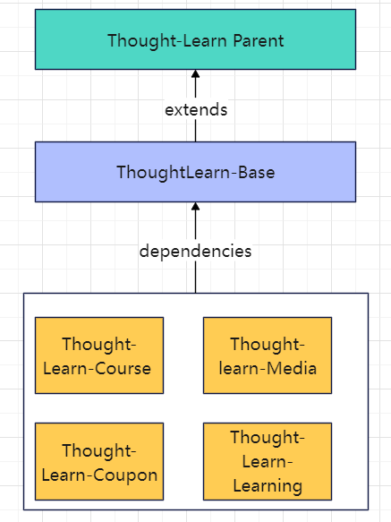
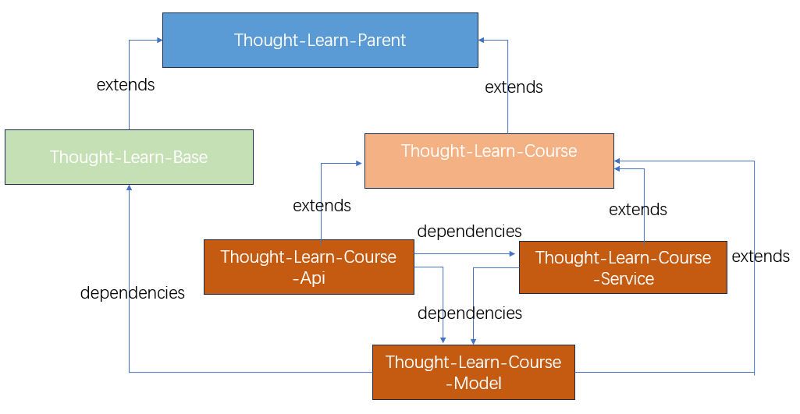

# Introduction
ThoughtLearn is a distributed online learning platform to provide high-quality courses for K12 stage users, which is mainly divided into course module, trading module, promotion module, multimedia resource module, authority module and so on

# Technical Section

| Function |Technology stack                   | 
|--|------------------------------------|
| Core framework | SpringBoot+SpringCloud+MyBatisPlus |         
| Database | MySQL                              |      
| Cache scheme| Redis                              |         
| Service registration & Configuration Center | Nacos                              |
| Distributed task scheduling | XXL-JOB                            |         
| File system | Minio                              |         
| Authority management | Spring Security+JWT+OAuth2         |         
| Message Queue | RabbitMQ                           |   
| gateway | SpringCloudGateway                 |  

# Project-Structure

## 1. Overview

## 2. Every Module

Take the course management module as an example:

# System Functions

## 1.Course information editing

Adding, deleting, changing and checking course information, including basic course information, course marketing information, course plan, and course faculty information.

## 2.Multimedia resources upload

### 2.1 Upload pictures

Three steps involving two services:

- Save the course image address to the content management database
- Saving the address of the course image to the content management database and saving it to the distributed file system MinIO.
- Save file information to the media management database

### 2.2 Uploading video (intermittent upload)

First check whether the uploaded file exists. If the file does not exist, the front-end chunking, check whether the chunked file exists or not, and upload it if it does not exist. The front-end will upload the chunks and request the media service to merge the chunks.

## 3.Video transcoding processing

The task scheduling center broadcasts the job slice, the executor receives the broadcast job slice, reads the pending video tasks from the database, and reads the unprocessed and failed tasks. The executor updates the task as processing, and downloads the file to be processed from MinIO according to the task content. The executor starts multiple threads to process the task.

When the task is completed, upload the processed video to MinIO, update the result of the task processing, and also update the access address of the file to the task processing table and file table, and finally write the task completion record to the history table.

## 4.Course Audit and Publishing

Fill in the information of a course and submit it for review, wait for the review to pass and then you can publish the course, you can also modify the course after submitting the review. After passing the audit, we can click on the course release, the course will be publicly displayed on the website after release, the course information needs to be displayed on the website to solve the performance problem of the course information display. So we store course cache information, course index information, and course static pages when the course is published.

## 5.Coupon Collection

Users collect coupons：we need to design a user coupon table, that is, who has collected which coupon, used to save the relationship between the user and the coupon, the use of the state and other information. When a user collects a coupon, we need to save a piece of data to the user coupon table.

The process of collecting coupons is like this: first of all, it is a verification measure, the main thing is to verify whether the remaining stock of coupons is sufficient and verify the limited number of coupons per person, and all the verification passes before you can collect the coupons. Add a new record to the user coupon *user_coupon* table, and then update the inventory in the *coupon*  table.

